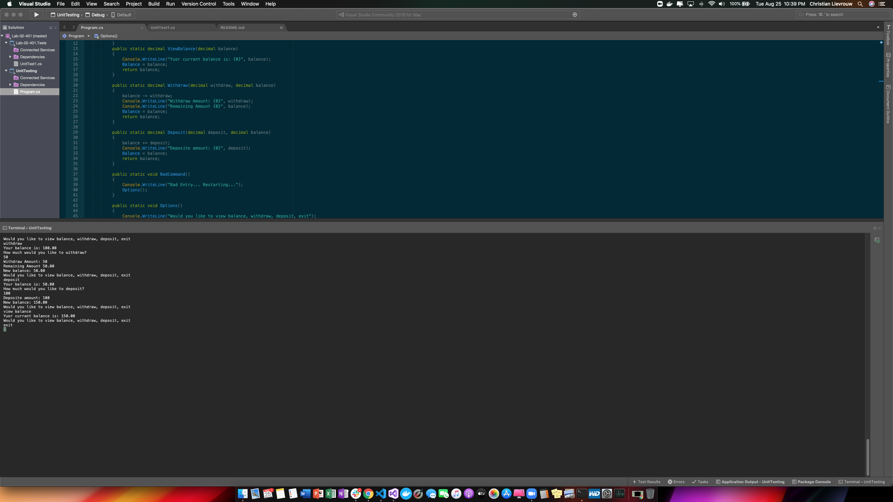

# Lab-02-401

In this application a user has a bank account and they can deposit or withdraw from thier account. The user can also see their balance at anytime. When the user irst gets on it asks them if they would like to view balance, withdraw, deposit, or exit the program. When they choose one option they are able to either add or take away from their total balance. The program keeps the user from going negitive in their account. The application does also run tests to make sure the application can handle basic needs.

